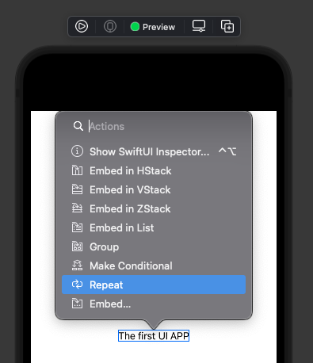

# Swift UI

- Lanzado en 2019.
- El mismo codigo para todos los entornos.
- Visualizacion instantanea.
- Poder realizar drag and drog.
- Programacion declarativa.
- Storyboard es remplazado por canvas.

## Programacion declarativa e imperativo

Swift UI no es un lenguaje declarativo.

MVVM: El patrón modelo–vista–modelo de vista es un patrón de arquitectura de software. Se caracteriza por tratar de desacoplar lo máximo posible la interfaz de usuario de la lógica de la aplicación.

Swift UI convive con los diferentes entornos de storyboard y UI Kit

- UIViewRepresentable: Si se desea cambiar un componente de UI Kit a Swift UI. A todo se le añade Representable.

## Uso Texto en Swift UI

- UILabel => Text(""): Ahora esta clase se llama solo "Text" (Only read)

- Command + Click sobre un elemento, despligua el menu de opciones



## Editar estilos de texto

Se deben llamar los modificadores tipo css, estos se llaman tipo los metodos de una clase.

El parametro del modificador va dentro del metodo

- .fontWight(.bold): Viene del objeto Text

- .font(.title): Esto funciona como bootstrap donde tenemos clases de texto estandar, siempre usar los estandares.

- .font(.system(.title, design: .rounded)): Esto especifica que el texto es enfocado o redoneado, hace que se vea mejor.

```swift
Text("The first UI APP")
    .fontWeight(.bold)
    .font(.title)
    .padding()

Text("Secod text")
    .font(.system(size: CGFloat(16)))
    .padding()

```

Nota: A los textos se les puede poner tamaños con el modificador Frame

Source: https://developer.apple.com/documentation/swiftui/font

- .foregroundColor() Le especifica el color a un texto

## Tipografia

Nota: Todos los textos vienen con la letra del sistema.

¿Como Cambiar la tipografia de letra del sistema?

Para ello se agrega el parametro .custom("Nombre de la fuente", size: 25 OR .large) al metodo

<b>Como agregar fuentes personalizadas?</b>
Se agrega la carpeta con la fuente personalizada, y luego se agrega con .custom como primer parametro.

```swift
.font(.custom("Arial", size: CGFloat(20)))
```

## Texto de multiples lineas

Simplemente basta con agregar el texto al metodo a la Clase Text() y ya este se muestra completo.

<strong>Alineado del texto</strong>

Podemos usar la propiedad: .multilineTextAlignment(), a esta propiedad le podemos pasar las siguientes propiedades:

- .leading: El texto inicia a la izquierda. (Izquierda)
- .center: El texto inicia al centro.
- .trailing: El texto inicia al final (Derecha)

<strong>Limitar el numero de lineas</strong>

Se utiliza la propiedad .lineLimit(10) al final agrega los 3 puntos (Lo que se conoce como Tail en Ingles)

* Por defecto el valor de .lineLimit(nill) es nil

Nota: habeces el .lineLimit no funciona por lo que se debe fixiar:

```
.fixedSize(horizontal: false, vertical: true)
```

<strong>Como modificar donde se corta el texto de .lineLimit(??)</strong>

Para ello se utiliza la propiedad: .trucationModel(.) Se le pasan los siguientes parametros

- .head : Agrega los tres puntos al inicio de la ultima linea.
- .middle: Agrega los tres puntos el centro de la ultima linea.
- .tail: Agrega los tres puntos al final. (Valor por defecto)

## Padding and Spacing

- lineSpacing(CGFloat(1)): Esta propiedad se utiliza para separar las lineas, es el interlineado del texto.

- padding(): Se le puede pasar CGFloat, pero es mejor usar el estandard.

El padding recibe parametros como los siguiente, donde se indica la direccion del padding

- .padding(.top, 16)
- .padding(.trailing, 16)
- .padding(.bottom, 16)
- .padding(.leading, 16)
- .padding([.top, .horizontal]) // Varios padding en uno | Se evita el doble padding

Nota: El orden de los padding altera el resultado.


## Rotar el Texto

- .rotationEffect(.degrees(80)) : Rota un texto 80 grados; Como segungo parametro opcional se le puede definir un anchor,
a este anchor se le un UnitPoint(x:, y:) donde se coloca la info de donde comienza la rotación

- .rotation3DEffect(.degrees(50), axis: (x: 1, y: 0, z: 0)) Se rota un texto en 3D

- .shadow(color: .gray, radius: 1, x: 5, y: 10)

## Colores del sistema

- .primary
- .secundary

## Como Debug sin compilar

Se muestra la terminal : View -> Debug Area -> Activate Console

Luego en el preview se le da click derecho al boton de play en preview debug


## Colocar un Background

```swift
var body: some View {
    Color.green.edgesIgnoringSafeArea(.all)
}
```


