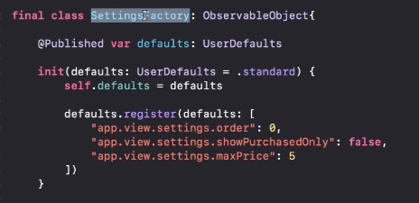
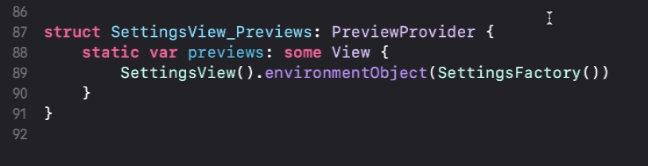

# Persistencia

## UserDefaults

## Realizar una acción al mostrar una vista, en este caso la navegación

* Este es el viewDidAppear

```swift
.onAppear{
	Mostar información en pantalla de data que viene de API o Base de datos
}
```

## Environment Object

Son propiedades que son accesibles desde todas las vistas

Los observadores deben ser hijos de ObservableObject

<strong>Palabras claves: </strong>

- EnvironmentObject: Se subscribe a los cambios de un ObservableObject
- ObservableObject: Los cambios de la entidad son notificados a la propiedas @Published
- @Published: 

Se debe import Combine para usar EnvironmentObject

```
import Combine
```

Ej:



<strong>Variable EnvironmentObject</strong>

Esta debe ser una propiedad de la clase Observer (ObservableObject)

```
@EnvironmentObject var user: UserObserver

```

<strong>2 - A la vista dentro del preview, se le debe inyectar el observador como dependencia</strong>



Nota: donde quiera que se haga uso del EnvironmentObject, esta variable debe ser inyectada como dependencia.