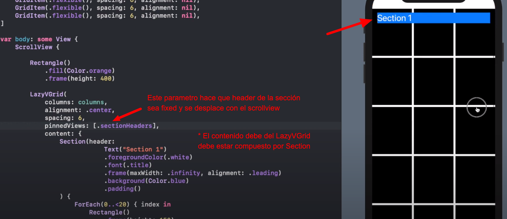

# LazyVGrid & LazyHGrid

Como su nombre lo indica se utilizan para crear Grid

## LazyVGrid

Recibe dos parameros:

- columns: [GridItem(.fixed(100))]: Este recibe un array de GridItem, que en en LazyGrid vienen siendo las columnas.
Cada posicion del array es una columna.

- content: () -> void: Este es un Clousure para pasarle el contenido al LazyGrid

Nota: es Lazy por que no carga todos los elemento, simplemente los que muestra es los que renderiza.

```swift

// Rango de elemtos
let elements = 1...50

// Grid de tres columnas
let gridItems = [
	GridItem(.fixed(120)),
	GridItem(.fixed(120)),
	GridItem(.fixed(120))
]

// Desplegamos el grid
LazyVGrid(columns: gridItems, content: {
	ForEach(elements, id: \.self){ element in
		Text("Elemento No. \(element)")
	}	
})

```

### Entendiendo la estructura GridItem

A esta se le pueden pasar varios parametros:

- .fixed(): El tamaño es fijo.

- .adaptative(minimum: , maximum: ): No se controla el numero de vista a mostrar, si caben 5 vista la distribuira todas
en la columna

- .flexible(minimum: ): Si no se le especifica ningun parametro se adapta perfectamente a la pantalla,
se recomienda este ultimo para realizar grid perfectos

```
let grid:[GridItem] = [
	GridItem(.flexible(), spacing: nil, alignment: nil),
	GridItem(.flexible(), spacing: nil, alignment: nil),
]
```

## Header Fixed


